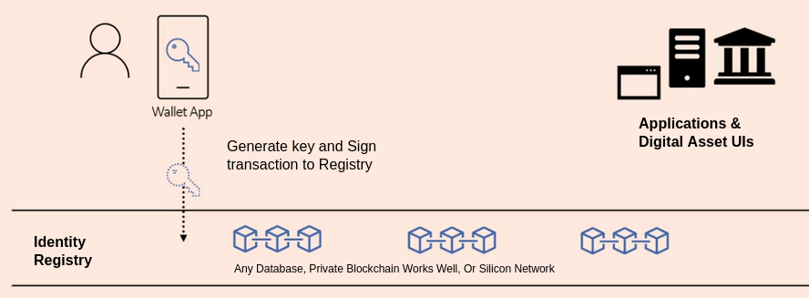
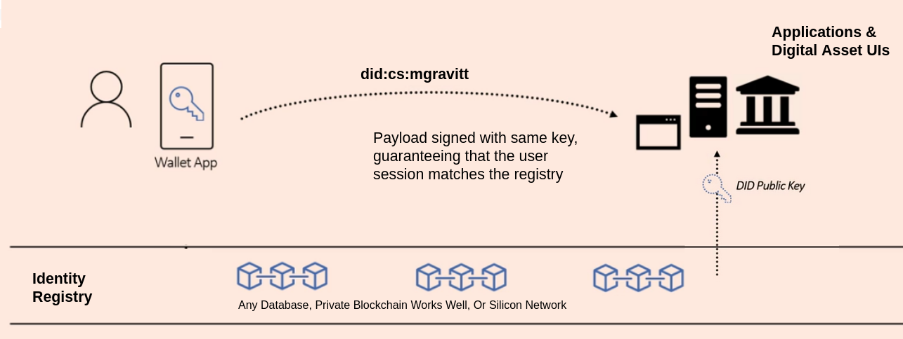

# Authentication
## User registration
- User downloads mobile app
- Generates key on device
- Signs transaction to the Registry



## Login or Access UI/app
- App presents QR code 
- User scans QR code and get payload
- User signs payload on app 
- Signed payload is broadcast to app



The only secrets exist on the user's devices.

# Credentials
Once identities are created, users can issue credentials.

Example:
- User alice@credit-suisse.com is the overall owner of the Homium asset.
- Alice grants bob@credit-suisse.com the authority to approve new Homium deals.

This credential may have a namespace perhaps like this:
```
https://credit-suisse.com/credentials/digital-assets/homium/approve
```

## Issue Credential
Alice signs a payload that expresses that she is issuing a credential the approve credential to Bob.

This resulting payload is portable, meaning it can be a QR code, email, text download, etc. There are no secrets in it (although there is metadata). 

When Bob (or Promerit) wants to use that credential (e.g. call the ```homctl``` REST web service), he (or it) signs the credential with their key. 

My app, running as ```homctl```, can then verify that Bob is who he says he is and they he was granted the "approve" credential by Alice.

# Example Walkthrough

## Prequisites
- install DIDKit: https://spruceid.dev/docs/didkit/install
- put didkit and didkit-http in path

### Identities
- Homium Owner == Alice == the overall identity in charge of managing Homium-related credentials
- Homium Approver == Bob == the identity that will have the authority to approve new Homium deals

## Generate keys
The following commands creates 2 separate keys for the above identities. These would be generated on the mobile application.

``` bash
didkit generate-ed25519-key > homium-owner.jwk
didkit generate-ed25519-key > homium-approver.jwk
```

## Generate DIDs
``` bash
didkit key-to-did key --key-path homium-owner.jwk > homium-owner.did
didkit key-to-did key --key-path homium-approver.jwk > homium-approver.did
```

# Generate verification method
``` bash
didkit key-to-verification-method --key-path homium-owner.jwk > homium-owner.verification-method
```

# Example credential 
Use the ```homium-owner``` DID as the issuer and the ```homium-approver``` as the credential subject.
``` json
{
    "@context": "https://www.w3.org/2018/credentials/v1",
    "id": "https://credit-suisse.com/credentials/digital-assets/homium/approve",
    "type": ["VerifiableCredential"],
    "issuer": "did:key:z6MknWDoGxGY6a6ZbEBpP8n45tBdAGgMTEfBMs6tdKP3oHn5",
    "issuanceDate": "2021-07-19T21:41:50Z",
    "credentialSubject": {
        "id": "did:key:z6Mkrm1PTgDVmwLp87HqNEbwBc392hf87CX4qTsasMvXLutw"
    }
}
```

# Start the HTTP server (as Homium owner)
``` bash
didkit-http -p 9999 --key-path homium-owner.jwk & pid=$!
didkit_url=http://localhost:9999
```

# Issue a signed credential
``` bash

curl -fsS $didkit_url/issue/credentials \
    -H 'Content-Type: application/json' \
    -o homium-approve-credential-signed.jsonld \
    -d '{
    "credential": {
        "@context": "https://www.w3.org/2018/credentials/v1",
        "id": "https://credit-suisse.com/credentials/digital-assets/homium/approve",
        "type": ["VerifiableCredential"],
        "issuer": "did:key:z6MknWDoGxGY6a6ZbEBpP8n45tBdAGgMTEfBMs6tdKP3oHn5",
        "issuanceDate": "2021-07-19T21:41:50Z",
        "credentialSubject": {
            "id": "did:key:z6Mkrm1PTgDVmwLp87HqNEbwBc392hf87CX4qTsasMvXLutw"
        }
    },
   "options": {
        "verificationMethod": "did:key:z6MknWDoGxGY6a6ZbEBpP8n45tBdAGgMTEfBMs6tdKP3oHn5#z6MknWDoGxGY6a6ZbEBpP8n45tBdAGgMTEfBMs6tdKP3oHn5",
        "proofPurpose": "assertionMethod"
   }
 }'
```

## Review the signed credential
The proof, and in particular, the ```jws``` (JSON Web Signature), can ONLY be generated by the ```homium-owner``` and it can be cryptographically verified by anyone.
``` json
{
  "@context": "https://www.w3.org/2018/credentials/v1",
  "id": "https://credit-suisse.com/credentials/digital-assets/homium/approve",
  "type": ["VerifiableCredential"],
  "credentialSubject": {
    "id": "did:key:z6Mkrm1PTgDVmwLp87HqNEbwBc392hf87CX4qTsasMvXLutw"
  },
  "issuer": "did:key:z6MknWDoGxGY6a6ZbEBpP8n45tBdAGgMTEfBMs6tdKP3oHn5",
  "issuanceDate": "2021-07-19T21:41:50Z",
  "proof": {
    "type": "Ed25519Signature2018",
    "proofPurpose": "assertionMethod",
    "verificationMethod": "did:key:z6MknWDoGxGY6a6ZbEBpP8n45tBdAGgMTEfBMs6tdKP3oHn5#z6MknWDoGxGY6a6ZbEBpP8n45tBdAGgMTEfBMs6tdKP3oHn5",
    "created": "2021-07-19T18:53:04.682Z",
    "jws": "eyJhbGciOiJFZERTQSIsImNyaXQiOlsiYjY0Il0sImI2NCI6ZmFsc2V9..-p9FRdnebwJd9JODmIt5W41zZCn-f2vVFDuvR8MGbO9cVnHi3iP9GcqfG0YoVsRanG26of0_fJzd1-_M31niCA"
  }
}

```

# Verify the credential
Any party can verify the validity of the credential. 

```didkit``` reports that it has checked the proof and it is valid. No secrets are needed to verify a credential.

``` bash
didkit vc-verify-credential -v did:key:z6MknWDoGxGY6a6ZbEBpP8n45tBdAGgMTEfBMs6tdKP3oHn5#z6MknWDoGxGY6a6ZbEBpP8n45tBdAGgMTEfBMs6tdKP3oHn5 -p assertionMethod < homium-approve-credential-signed.jsonld

{"checks":["proof"],"warnings":[],"errors":[]}
```

# Create a presentation of the credential
The specific presentation of a credential... 
``` json
{
  "@context": ["https://www.w3.org/2018/credentials/v1"],
  "id": "https://credit-suisse.com/presentations/digital-assets/homium/approve",
  "type": ["VerifiablePresentation"],
  "holder": "did:key:z6Mkh4Q8sq4kj9dUAK63j4vXfM2AMmvkz1qqGbNxXqBfHiez",
  "verifiableCredential": {
    "@context": "https://www.w3.org/2018/credentials/v1",
    "id": "https://credit-suisse.com/credentials/digital-assets/homium/approve",
    "type": ["VerifiableCredential"],
    "credentialSubject": {
        "id": "did:key:z6Mkrm1PTgDVmwLp87HqNEbwBc392hf87CX4qTsasMvXLutw"
    },
    "issuer": "did:key:z6MknWDoGxGY6a6ZbEBpP8n45tBdAGgMTEfBMs6tdKP3oHn5",
    "issuanceDate": "2021-07-19T21:41:50Z",
    "proof": {
        "type": "Ed25519Signature2018",
        "proofPurpose": "assertionMethod",
        "verificationMethod": "did:key:z6MknWDoGxGY6a6ZbEBpP8n45tBdAGgMTEfBMs6tdKP3oHn5#z6MknWDoGxGY6a6ZbEBpP8n45tBdAGgMTEfBMs6tdKP3oHn5",
        "created": "2021-07-19T18:53:04.682Z",
        "jws": "eyJhbGciOiJFZERTQSIsImNyaXQiOlsiYjY0Il0sImI2NCI6ZmFsc2V9..-p9FRdnebwJd9JODmIt5W41zZCn-f2vVFDuvR8MGbO9cVnHi3iP9GcqfG0YoVsRanG26of0_fJzd1-_M31niCA"
    }
   }
}
```

## Sign the presentation
``` bash
 curl -fsS $didkit_url/prove/presentations \
    -H 'Content-Type: application/json' \
    -o presentation-signed.jsonld \
    -d '{
  "presentation": {
    "@context": ["https://www.w3.org/2018/credentials/v1"],
    "id": "https://credit-suisse.com/presentations/digital-assets/homium/approve",
    "type": ["VerifiablePresentation"],
    "holder": "did:key:z6Mkrm1PTgDVmwLp87HqNEbwBc392hf87CX4qTsasMvXLutw",
    "verifiableCredential": {
        "@context": "https://www.w3.org/2018/credentials/v1",
        "id": "https://credit-suisse.com/credentials/digital-assets/homium/approve",
        "type": ["VerifiableCredential"],
        "credentialSubject": {
            "id": "did:key:z6Mkrm1PTgDVmwLp87HqNEbwBc392hf87CX4qTsasMvXLutw"
        },
        "issuer": "did:key:z6MknWDoGxGY6a6ZbEBpP8n45tBdAGgMTEfBMs6tdKP3oHn5",
        "issuanceDate": "2021-07-19T21:41:50Z",
        "proof": {
            "type": "Ed25519Signature2018",
            "proofPurpose": "assertionMethod",
            "verificationMethod": "did:key:z6MknWDoGxGY6a6ZbEBpP8n45tBdAGgMTEfBMs6tdKP3oHn5#z6MknWDoGxGY6a6ZbEBpP8n45tBdAGgMTEfBMs6tdKP3oHn5",
            "created": "2021-07-19T18:53:04.682Z",
            "jws": "eyJhbGciOiJFZERTQSIsImNyaXQiOlsiYjY0Il0sImI2NCI6ZmFsc2V9..-p9FRdnebwJd9JODmIt5W41zZCn-f2vVFDuvR8MGbO9cVnHi3iP9GcqfG0YoVsRanG26of0_fJzd1-_M31niCA"
        }
    }
  },
  "options": {
    "verificationMethod": "did:key:z6MknWDoGxGY6a6ZbEBpP8n45tBdAGgMTEfBMs6tdKP3oHn5#z6MknWDoGxGY6a6ZbEBpP8n45tBdAGgMTEfBMs6tdKP3oHn5",
    "proofPurpose": "authentication"
  }
}'
```

### Signed presentation 
This payload has the cryptographic proof that Bob is Bob and he has the authority to approve new Homium deals, issued from Alice.

``` json
{
  "@context": ["https://www.w3.org/2018/credentials/v1"],
  "id": "https://credit-suisse.com/presentations/digital-assets/homium/approve",
  "type": ["VerifiablePresentation"],
  "verifiableCredential": {
    "@context": "https://www.w3.org/2018/credentials/v1",
    "id": "https://credit-suisse.com/credentials/digital-assets/homium/approve",
    "type": ["VerifiableCredential"],
    "credentialSubject": {
      "id": "did:key:z6Mkh4Q8sq4kj9dUAK63j4vXfM2AMmvkz1qqGbNxXqBfHiez"
    },
    "issuer": "did:key:z6Mkqrhc4U3LY47D88j8KYhXRY5eWgipTipmX6arXecykfpL",
    "issuanceDate": "2021-07-19T21:41:50Z",
    "proof": {
      "type": "Ed25519Signature2018",
      "proofPurpose": "assertionMethod",
      "verificationMethod": "did:key:z6Mkqrhc4U3LY47D88j8KYhXRY5eWgipTipmX6arXecykfpL#z6Mkqrhc4U3LY47D88j8KYhXRY5eWgipTipmX6arXecykfpL",
      "created": "2021-07-19T16:28:27.841Z",
      "jws": "eyJhbGciOiJFZERTQSIsImNyaXQiOlsiYjY0Il0sImI2NCI6ZmFsc2V9..t9N_yZbikIqApFSNRLW86fV0E-ue64Wb_62rTNTzAnLIYcC-X79eiloL5pCl565iORud2wWMekiM3Pp1LaP3Cw"
    }
  },
  "proof": {
    "type": "Ed25519Signature2018",
    "proofPurpose": "authentication",
    "verificationMethod": "did:key:z6Mkqrhc4U3LY47D88j8KYhXRY5eWgipTipmX6arXecykfpL#z6Mkqrhc4U3LY47D88j8KYhXRY5eWgipTipmX6arXecykfpL",
    "created": "2021-07-19T17:04:07.193Z",
    "jws": "eyJhbGciOiJFZERTQSIsImNyaXQiOlsiYjY0Il0sImI2NCI6ZmFsc2V9..Zi-gKSNk7WV2Cnj8PQ-h0cnYKy6A8D9ke9Ce3-LY1tyRm5gH-QWXKIJfcT_HsecyO1U2Q1TwX7vJWCxytVPhDw"
  },
  "holder": "did:key:z6Mkh4Q8sq4kj9dUAK63j4vXfM2AMmvkz1qqGbNxXqBfHiez"
}
```

